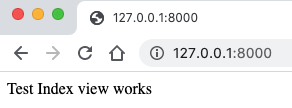
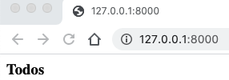
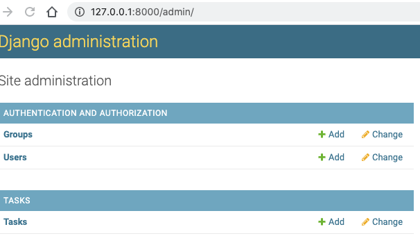

# Django Todo CRUD 
### Based upon the `Dennis Ivy` <a href = "https://www.youtube.com/watch?v=4RWFvXDUmjo" >tutorial</a> 
#### Project Setup
1) Start virtual environment using `pipenv`
    - another way to set up a virtual environment is with Python's `venv` <a href = "https://docs.python.org/3/tutorial/venv.html" > Python Virtual Environment documentation </a>
    - 
    ~~~ bash 
    pipenv shell
    ~~~
    - NOTES 
        - to exit the pip virtual environment, type `exit` in the terminal window where it was launch
        - `pip list` will show installed packages
        - `pipenv graph` will show a dependency graph showing sub-dependencies for installed packages
2) Install Django  
    ~~~ bash
    pipenv install django
    ~~~    
3) Create new `project` called `todo`
    ~~~ bash
    django-admin startproject todo
    ~~~    
4) Change directory into `todo` and launch server
    - default rocket ship start page should be displayed
    ~~~ bash
    cd todo
    python manage.py runserver
    ~~~    
5) Close server and run first migration
    ~~~ bash
    python manage.py migrate
    ~~~    
6) Create `superuser`
    - uses currently logged in user as default
    - email is optional
    ~~~ bash
    python manage.py createsuperuser
    ~~~ 
 7) Start server and log into the admin panel `8000/admin` 
    - Start server `python manage.py runserver`  
    - login into to admin panel with superuser credentials
    - once verified, quit server
8) Create a new `app` called `tasks`
    - the `tasks` folder will show up inside the `todo` folder
    ~~~ bash
    python manage.py startapp
    ~~~   
    - the directory of tasks will look like:
    ~~~ text
    tasks/
    __init__.py
    admin.py
    apps.py
    migrations/
        __init__.py
    models.py
    tests.py
    urls.py
    views.py
    ~~~
9) Add `tasks` to the `INSTALED_APPS` within `todo/settings.py`
    ~~~ py
    ...
    INSTALLED_APPS = [
        'django.contrib.admin',
        'django.contrib.auth',
        'django.contrib.contenttypes',
        'django.contrib.sessions',
        'django.contrib.messages',
        'django.contrib.staticfiles',

        # added tasks app
        'tasks',
    ]
    ...
    ~~~

### Setup a Simple Default View
1) Inside `tasks/views.py` import `HttpResponse`
    ~~~ py
    from django shortcuts import render
    from django.http import HttpResponse
    ~~~
2) Create a simple default view
    ~~~ py
    # Create your views here.
    def index(request):
        return HttpResponse("Test Index view")
    ~~~
#### Create a `URLconf` (e.g. URL configuration) inside of the tasks `app`
- this will map the view to a URL
1) Create a `urls.py` file inside the `tasks` folder
2) Import path at top of `urls.py`
    ~~~ py
    from django.urls import path
    ~~~
3) Add a URL pattern
- `path` receives a `route` and a `view`
    - `route` is a string that receives a `URL pattern`
    - IF a route is found, the `view` function is called
    - the `views.py` module contains the `index` function
    ~~~ py
    from django.urls import path
    from . import views

    # define paths
    urlpatterns = [
        path ('', views.index) 
    ] 
    ~~~
####  Update the root `URLconf` for the todo `project`
1) Add the import `django.urls.include` to `/todo/todo/urls.py`
- It originally looks like `from django.urls import path`
~~~ py
    from django.urls import path, include
~~~
2) Append `path('', include('tasks.urls')),` to the `urlpatterns` list
- the imported function `include` will allow other `URLconfs` to be referenced   
- `/todo/todo/urls.py` should now look like  
    ~~~ py
    from django.contrib import admin
    from django.urls import path, include # added include 7:47

    urlpatterns = [
        path('admin/', admin.site.urls),
        path('', include('tasks.urls')), 
    ]
    ~~~
3) After launching virtual environment and relaunching the server, the browser will show the simple default view

#### Define `list` template that shows list of todos
1) Create folders `templates/tasks` within the `tasks` app
2) Create the file `list.html` inside `templates/tasks`
3) Add the following to `list.html`
    ~~~ html
    <h3> Todos </h3>
    ~~~
4) Modify the `tasks/views.py` file to return the template file `list.html`
- replace `return HttpResponse("Test Index view works")` with
`~~~ py
#### Create view to show list of tasks template
def index(request):
    return render(request, 'tasks/list.html')
5) Refreshing the browser should display the template

#### Setup Database
1) Create the following model inside `tasks/models`
    ~~~ py
    class Task(models.Model):
        title = models.CharField(max_length = 200)
        complete = models.BooleanField(default=False)
        created = models.DateTimeField(auto_now_add=True)

        def __str__(self):
            return self.title 
    ~~~
2) Create tables for migration
- Quit server
- In terminal, run `python manage.py makemigrations`
3) Migrate the database
- In terminal, run `python manage.py migrate`
4) Register the database in `admin.py`
5) Launch the admin panel to verify `Tasks` table created

#### Update View & Template
- the Django shortcut function `render()` takes two arguments:
    - the `request` object
    - a template name OR sequence of template names
- optional arguments:
    - context: a dictionary of values
- `Task.objects.all()` returns a new QuerySet that is a copy of the 
current one. 
- the `context` dictionary of `tasks` is passed as the 3rd argument
1) Update `views.py`
    ~~~ py
    from models import *
    # Create your views here.
    def index(request):
        tasks = Task.objects.all()  # returns everything
        context = {'tasks': tasks}
        return render(request, 'tasks/list.html', context)
    ~~~
    - Using `template tags`, use a for loop to render tasks
    ~~~ html
    <h3> Todos </h3>

    
        

            
{{tasks}}

        

    
    ~~~
2) Use the `Admin Panel` to add a few tasks
3) Refreshing the browser shouls now display the tasks    
### Add functionality 
- Use `ModelForms` helper class  
- <a href = "https://docs.djangoproject.com/en/3.0/topics/forms/modelforms/"> ModelForm Django documentation</a> 
1) Create `forms.py` within `tasks` app
2) Import `forms`, `ModelForm`, & all models
    ~~~ py
    from django import forms
    from django.forms import ModelForm

    from .models import *
    ~~~
3) Create `Taskform` inherited from `ModelForm`
- define `Meta` class within
    ~~~ py
    ...
    class TaskForm(forms.ModelForm):
        class Meta:
            model = Task
            fields = '__all__'
    ~~~
4) Modify `views.py`
- add the `redirect` import to return a GET request to show updated tasks
- the `redirect` function returns a `HttpResponseRedirect` to the specified URL 
    ~~~ py
    from django.shortcuts import render
    from django.http import HttpResponse

    from .models import *
    from .forms import *

    # Create your views here.
    def index(request):
        tasks = Task.objects.all()  # returns everything, e.g.  returns a new QuerySet that is a copy of the current one

        if request.method == 'POST':
            form = TaskForm(request.POST)

            if form.is_valid:
                form.save()
            return  redirect('/')
        
        context = {'tasks': tasks, 'form': form}  # create a context dictionary
        return render(request, 'tasks/list.html', context)
    ~~~
5) Update the 'list' template
- we specify `form.title` to only show `task` and not all the fields 
- we must add `csrf_token` that is enabled by default in the list of the `MIDDLE_WARE` section in `settings.py` to prevent Cross Site Request Forgeries
- <a href = "https://docs.djangoproject.com/en/3.0/ref/csrf/"> CRSF Django documentation</a>

    ~~~ html
    <h3> Todos </h3>

    <form method = "POST" action = "/"> 
        
        {{form.title}}
        <input type="submit" name = "Create Task">
    </form>

    
        

            
{{task}}

        

    
    ~~~
### Update functionality  
1) Create a new template called `update_task.html` for updating a task
2) Add the following to the template
- `instance` is assigned `task` so that the form is prefilled with the instance of the object received by the specific `id`
- the instance will have the same model and will know how to prefill the form
- the `action` is left blank we want to URL to be same page
    ~~~ py
    <h3> Update Task </h3>

    <form method = "POST" action = "">
        

        {{form}}
        <input type = "submit" name = "Update Task"/>
    </form>
    ~~~
3) Build the view for `updateTask`
- `form =  TaskForm(request.POST, instance = task)` takes the updated POST data and puts it into the current `instance` 
    ~~~ py
    def updateTask(request, prim_key):
        task = Task.objects.get(id = prim_key) # id comes from primary key

        form =  TaskForm(instance = task)

        if request.method == 'POST':
            form =  TaskForm(request.POST, instance = task)
            if form.is_valid():
                form.save()
                return redirect('/') # send back to home page

        context = {'form': form}   

        return render(request, "tasks/update_task.html", context)
    ~~~
4) Update URL mapping in `url.py`
- use the named URL pattern `update_task`
- also add in the named URL pattern `list`
- using named URL patterns allows URL reversing
<a href = "https://docs.djangoproject.com/en/3.0/topics/http/urls/#naming-url-patterns"> URL dispatcher Django documentation</a>
- the primary key is passed as a string although using as integer would also work e.g. `<int:prim_key>/`
- we also add names to both URL patterns
    ~~~ py
    # define paths list
    urlpatterns = [
        path ('', views.index, name = "list"), 
        path('update_task/<str:prim_key/', views.updateTask, name = "update_task"),
        
    ]  
    ~~~
5) Add a link to the update template inside the list template
- template tags are used
- `task.id` is used to create a link to the task
    ~~~ html
    
        

            <a href = ""> Update </a>
            
{{task}}

        

    
    ~~~
### Delete functionality
1) Create new template called `delete.html`
- the specified item to be deleted is included in the confirmation prompt
- if user choses to cancel, they are redirected to the home page
    ~~~ html
    
 Are you sure you want to delete "{{item}}" ? 

    <a href = ""> Cancel </a>

    <form method = "POST" action = "">
        

        <button type = "submit"> Delete </button>
    </form>
    ~~~
2) Update `urls.py`
    ~~~ py
    urlpatterns = [
        path ('', views.index, name = "list"), 
        path('update_task/<str:prim_key>/', views.updateTask, name = "update_task"),
        path('delete/<str:prim_key>/', views.deleteTask, name = "delete"),
    ]  
    ~~~
3) Add the `deleteTask` to `views.py`
    ~~~ py
    def deleteTask(request, prim_key):
        item = Task.objects.get(id=prim_key)

        if request.method == 'POST':
            item.delete()
            return redirect('/')

        context = {'item': item}

        return render(request, 'tasks/delete.html', context)
    ~~~
 ### Add Strike through for completed items   
 - update `list` template to test if completed is True
 ~~~ html
    
        

            <a href = ""> Update </a>
            <a href = ""> Delete </a>
            
            
            <strike>{{task}}</strike>
            
             {{task}} 
            

        

    
 ~~~
 ### Styling 
 1) Add `BootstrapCDN` to `list.html`
 ~~~ html
<link rel="stylesheet" href="https://stackpath.bootstrapcdn.com/bootstrap/4.4.1/css/bootstrap.min.css" integrity="sha384-Vkoo8x4CGsO3+Hhxv8T/Q5PaXtkKtu6ug5TOeNV6gBiFeWPGFN9MuhOf23Q9Ifjh" crossorigin="anonymous">
 ~~~
 2) Add `Internal CSS` to `list.html`
 ~~~ html
 

 ~~~
